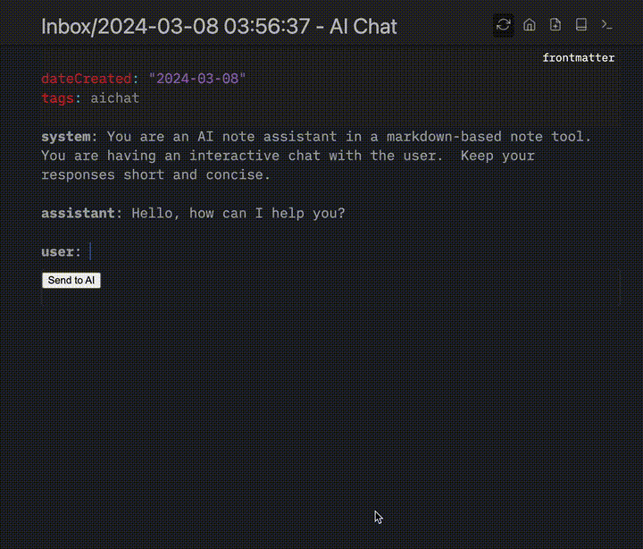
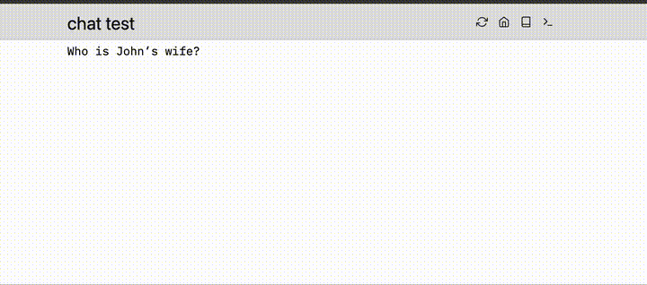
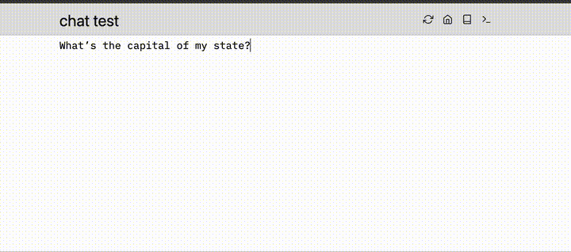

Ever wanted to chat with an AI/LLM directly from your editor or notes?  Now you can!

Run `AI: Chat on current page` or press (CTRL|CMD)+SHIFT+ENTER on any page and that page will become a new chat.

Simple example of what this looks like:

In addition to a normal chat you could have in any chatgpt-like interface, you can also reference your own notes (or others’ via federation) and those notes will automatically be sent as context to the LLM.

**Note**:  Be careful with this and what information you are sending to 3rd parties.

One more helpful chat feature is the ability to specify [[Configuration/Chat Instructions]] to customize the LLM’s responses towards you.

